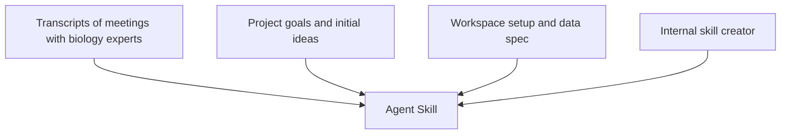


 

# Agent skills for biological data analysis

## The problem

I was working on a biological data analysis problem centered on biological sequences, with two assays that capture related properties of these sequences. One was relatively easy to run, but its readout was only an indirect view of the quantity we actually cared about. The other was harder to obtain, but it measured the target property more directly.

The first assay produced a per-position measurement along each sequence, whereas the second produced a single sequence-level measurement. The goal was not only to assess whether the two assays were correlated, but also to determine whether features derived from the first assay’s positional signal could be summarized into a single score that served as a reliable proxy for the second assay. In practice, that meant asking which aspects of the positional signal were worth extracting, and how they should be combined. If that worked, the first assay could potentially be used as a more accessible surrogate for the second in future work.

Before starting the analysis, I selected a diverse and representative library of sequences on which to run both assays.
## What went into the skill

My goal was to build an agent skill that contained enough context and instructions to carry out the analysis reproducibly, rather than relying on a one-off prompt. For a broad introduction to Agent Skills and the SKILL.md format, see the [Agent Skills overview](https://agentskills.io/home).

I started by asking biologists to walk me through the wet-lab assays, the experimental details, the important caveats, and the scientific questions we were actually trying to answer. I recorded the conversations and used the transcripts as the starting point for the skill's biological/wet-lab context.

From there, I layered in my own notes on the project goals, the structure I wanted the analysis to follow, some initial ideas of methods to explore, and practical instructions about how the workspace should be organized. That included what intermediate artifacts to save (such as scripts, pre-processed data), which interpretation files to maintain and how to keep a running journal of the work. I also included clear guidance on expected data formats, preprocessing constraints, and paths to the data files. I used all of that material, along with our internal skill creator (that just explains the format the SKILL.md file should have, along with our standard coding practices, some information about folder structure and other practical useful information) to generate the first version of the skill using an LLM. Open-source skill creators such as [Anthropic’s skill creator](https://github.com/anthropics/skills/blob/main/skills/skill-creator/SKILL.md) are also available.

That skill encoded not only what to do, but how to do it in a way that was inspectable and reproducible: engineer candidate features from the more accessible assay into sequence-level scores, study the correlation with the scores from the second assay, and document each step well enough that the full workflow could be rerun and reviewed.

## The first agent pass and iterative improvements

In this project, I happened to run the skill-based analysis with Claude Opus 4.6, but the skill is model-agnostic and can be used with other LLMs as well. The first version of the skill was already useful. It could take the project from raw data to preprocessing, visualizations, baseline analyses and interpretations so much faster than I would have done by hand.  But that first pass also exposed the main limitation: fast execution is not the same thing as scientific exploration. I noticed that the agents strictly applied the methods I had described as vague ideas to try, and nothing else. Zooming in on the interpretation files, I also saw hypotheses presented as general truths, a lack of supporting evidence for a lot of claims, and questionable biological interpretations.

What allowed me to get closer to real scientific exploration was adding two sections in the skill that forced the agent to behave more like a careful collaborator. First, scientific rigor guidelines that required it to present uncertain statements as hypotheses rather than truths, identify alternative explanations when doing so, and always explicitly link any statement to the associated plot/data. I also required it to ground all interpretations in the biological reality of the assays and the uncertainty associated with the measurements.

Second, I added an explicit iteration cycle. After each full pass, the agent had to review the current state of the analysis, identify biologically meaningful new directions to extract features and scores from the per-position signals. Then, it had to implement everything as reproducible analyses, and generate the corresponding plots and interpretations. Most importantly, I instructed it to keep iterating on candidate score construction methods until the resulting score reached a predefined minimum Pearson correlation threshold with the second assay based on all sequences.

In practice, that meant the workflow was not trying to defend the first reasonable answer. It was exploring the space of plausible sequence-level scores derived from the positional signal until the relationship with the target readout became strong enough to be genuinely useful. That was the turning point: the workflow stopped being just an automation layer and became a structured, open-ended search process.

## What came out of it

After a few rounds of iteration, the workflow converged on two scores that made sense from a biological perspective, and that each correlated with the second assay on their own. The most interesting part is that in its final cycle, the agent itself proposed combining these scores as predictors in a dual linear regression rather than treating them as separate alternatives. That suggestion only made sense because it first checked that the two scores were not themselves strongly correlated, so they had a chance of contributing complementary information rather than duplicating the same signal.

Framed by the iterative workflow encoded in the skill, that final combined model ended up giving a much stronger relationship with the target readout than the earlier baseline analyses, and the whole process: from raw data to preprocessing, exploration, and interpretation, with the refinement I had to do on the skill, took two or three days rather than the weeks this kind of work can easily consume.
## What I learned

What this project made clear to me is that in scientific work, rigor instructions matter just as much as analysis instructions. An agent can follow a computational plan, but that does not automatically make the result scientifically sound: the standards for interpretation, documentation, and follow-up have to be specified just as explicitly. 

More broadly, having an agent skill that structures domain knowledge: wet-lab experimental design, folder organization, data specifications and pre-processing, interpretation rules, and iteration triggers, makes that knowledge reusable in a way that scattered notes or verbal context never really are. 

It also reinforced a point that feels obvious in retrospect: agents are far more useful when given a workflow than when given a prompt. In the end, the real gain was not full automation, but a much faster loop for supervised exploration, where the hardest part was not generating code, but turning tacit scientific judgment into something explicit enough to be executed repeatedly.